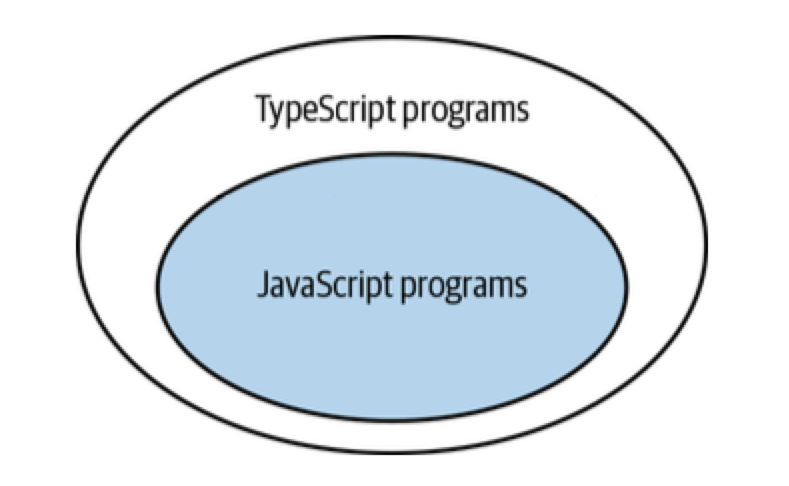
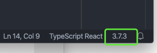
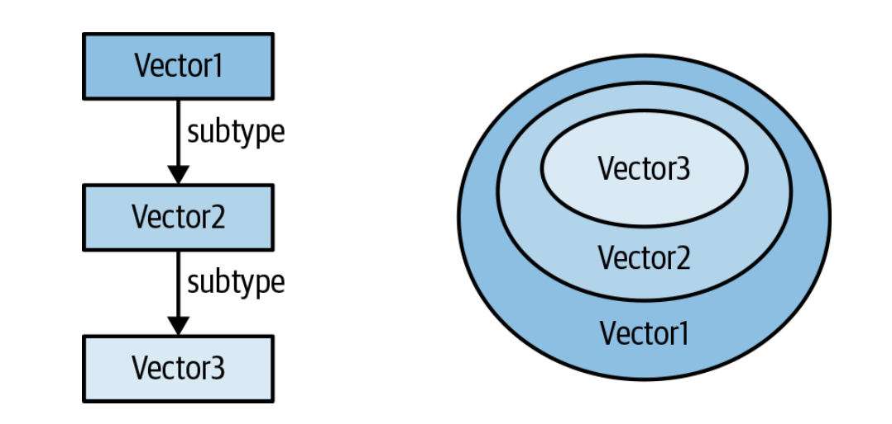
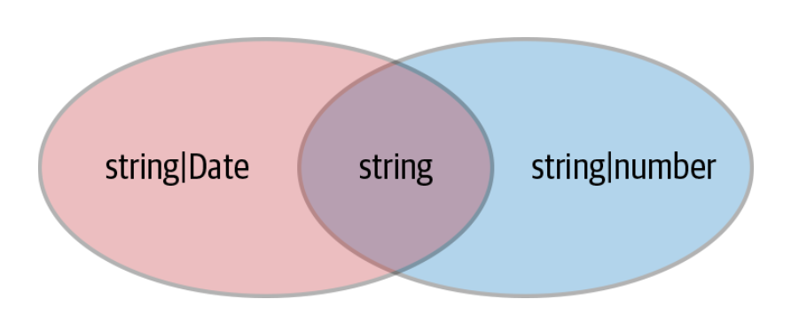
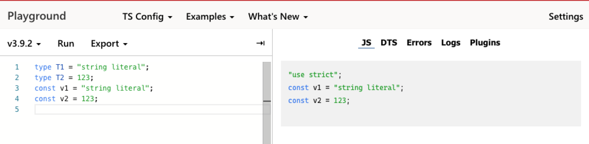
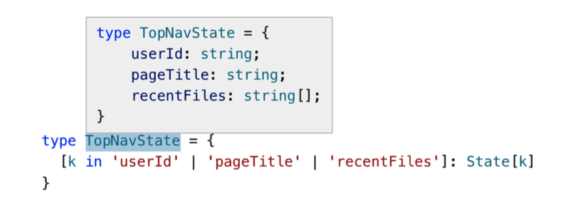

<!-- markdownlint-disable MD033 -->

# [《Effective TypeScript》](https://effectivetypescript.com/)读书笔记

<a href="https://effectivetypescript.com/">
  
</a>

## 目录

第一章 初识 TypeScript

- [01. 理解 TypeScript 与 JavaScript 之间的关系](#01-理解-TypeScript-与-JavaScript-之间的关系)
- [02. 明确你使用的 TypeScript 选项](#02-明确你使用的-TypeScript-选项)
- [03. 理解代码生成与类型系统是相互独立的](#03-理解代码生成与类型系统是相互独立的)
- [04. 理解 TypeScript 中的结构化类型](#04-理解-TypeScript-中的结构化类型)
- [05. 限制 `any` 类型的使用](#05-限制-any-类型的使用)

第二章 TypeScript 的类型系统

- [06. 利用编辑器探索类型系统](#06-利用编辑器探索类型系统)
- [07. 把类型看做值的集合](#07-把类型看做值的集合)
- [08. 学会判断一个符号是在类型空间还是值空间](#08-学会判断一个符号是在类型空间还是值空间)
- [09. 优先使用类型声明而不是类型断言](#09-优先使用类型声明而不是类型断言)
- [10. 避免使用对象包装器类型(String, Number, Boolean, Symbol, BigInt)](#10-避免使用对象包装器类型string-number-boolean-symbol-bigint)
- [11. 认识多余属性检查的局限性](#11-认识多余属性检查的局限性)
- [12. 在可能的时候为整个函数表达式应用类型](#12-在可能的时候为整个函数表达式应用类型)
- [13. 理解 `type` 和 `interface` 的区别](#13-理解-type-和-interface-的区别)
- [14. 使用类型操作和泛型避免重复代码](#14-使用类型操作和泛型避免重复代码)
- [15. 对动态数据使用索引签名](#15-对动态数据使用索引签名)

## 正文

### 01. 理解 TypeScript 与 JavaScript 之间的关系

**在语法层面上**，TypeScript 是 JavaScript 的超集。任何一段 JavaScript 程序，只要它没有语法错误，那么它也是一段合法的 TypeScript 程序(当然 TypeScript 的类型检查器可能会提示你一些类型相关的错误，但那只是一些具体问题，并不影响它”**是不是** TypeScript“ 这一问题的结论)。

TypeScript 使用 `.ts`(或 `.tsx`)作为文件扩展名。这并不意味着 TypeScript 是一种完全不同的语言。由于 TypeScript 是 JavaScript 的超集，因此你所有 `.js` 文件中的代码其实都是 TypeScript 代码。是否将 `main.js` 重命名为 `main.ts` 并不影响这一点。

所有的 JavaScript 程序都是 TypeScript 程序，这一论述的逆向说法并不成立：有的 TypeScript 程序携带了额外的声明类型的语法，而这部分语法是 JavaScript 不支持的。例如下面这段 TypeScript 程序：

```typescript
function greet(who: string) {
  console.log("Hello", who);
}
```

如果你使用 `node` 命令执行，那么你会得到一个 `SyntaxError: Unexpected token :` 的错误。 上述代码中的 `: string` 是一种类型注释。一旦你使用了这种语法，那么你就走出了 JavaScript 的范畴。



#### TypeScript 可以为纯 JavaScript 代码带来哪些收益

先看下面这段 JavaScript 代码：

```javascript
let city = "new york city";
console.log(city.toUppercase());
```

这代码在运行时会产生一个错误 `TypeError: city.toUppercase is not a function`。虽然代码里没有任何类型注释，但 TypeScript 的类型检查器还是会提示你下面的错误：

```typescript
let city = "new york city";
console.log(city.toUppercase());
//               ~~~~~~~~~~~ Property 'toUppercase' does not exist on type
//               'string'. Did you mean 'toUpperCase'?
```

这得益于 TypeScript 的**类型推断**机制。它可以从 `city` 变量的初始值中推断出该变量的类型。

TypeScript 类型系统的一个目标是在**不执行代码**的前提下检测出代码的运行时异常。这也是 TypeScript 被称为**静态**类型语音的原因。

#### 类型推断并不总是能够按照预期方式工作

假设有代码：

```javascript
const states = [
  { name: "Alabama", capital: "Montgomery" },
  { name: "Alaska", capital: "Juneau" },
  { name: "Arizona", capital: "Phoenix" },
];
for (const state of states) {
  console.log(state.capitol); // 这里有一个拼写错误
}
```

这段代码在运行时会输出：

```shell
undefined
undefined
undefined
```

这显然不是我们期望的结果，但同时这段代码也没有任何语法错误，所以 JavaScript 解释器在面对这类错误时并不能提供给我们更多信息。

如果我们把上述的代码交给 TypeScript 类型检查器，我们会得到一个非常明确的错误信息：

```typescript
for (const state of states) {
  console.log(state.capitol);
  //                ~~~~~~~ Property 'capitol' does not exist on type
  //                '{ name: string; capital: string; }'.
  //                Did you mean 'capital'?
}
```

从错误信息中我们可以明确的看到 TypeScript 推断出来的类型，以及拼写错误的属性名称。

下面让我们把上一段代码稍微修改一下：

```typescript
const states = [
  { name: "Alabama", capitol: "Montgomery" },
  { name: "Alaska", capitol: "Juneau" },
  { name: "Arizona", capitol: "Phoenix" },
];
for (const state of states) {
  console.log(state.capital);
  //                ~~~~~~~ Property 'capital' does not exist on type
  //                '{ name: string; capitol: string; }'.
  //                Did you mean 'capitol'?
}
```

这一次 TypeScript 的类型检查器依然给出了错误提示，但它并没有很好的理解我们的真实意图。我们真正想要拼写的是 `capital` 而非 `capitol`。这时候**类型注释**就派上用场了。

```typescript
interface State {
  name: string;
  capital: string;
}
const states: State[] = [
  { name: "Alabama", capitol: "Montgomery" },
  //                 ~~~~~~~~~~~~~~~~~~~~~
  { name: "Alaska", capitol: "Juneau" },
  //                ~~~~~~~~~~~~~~~~~
  { name: "Arizona", capitol: "Phoenix" },
  //                 ~~~~~~~~~~~~~~~~~~ Object literal may only specify known
  //                         properties, but 'capitol' does not exist in type
  //                         'State'. Did you mean to write 'capital'?
];
for (const state of states) {
  console.log(state.capital);
}
```

通过类型注释，我们明确的告诉 TypeScirpt 类型检查器某个变量的类型应该是什么。

#### 通过了 TypeScript 的类型检查并不意味着不会出现运行时错误

看下面这段代码：

```typescript
const names = ["Alice", "Bob"];
console.log(names[2].toUpperCase());
```

虽然这段代码在 TypeScript 的类型检查器眼里并没有什么不妥，但我们一眼就能看出这段代码在运行时会产一个 `TypeError: Cannot read property 'toUpperCase' of undefined` 的异常。TypeScript 会假定数组访问在数组范围之内，但事实并非始终如此。产生这类异常的根本原因在于 TypeScript 对值类型的理解与现实存在偏差。

### 02. 明确你使用的 TypeScript 选项

TypeScript 提供了大量的配置项供我们设置，其中一部分用于设置待编译文件的路径，另一部分被称为”[编译选项(Compiler Options)](https://www.typescriptlang.org/docs/handbook/compiler-options.html)“的配置项则决定了 TypeScript 语言自身的行为。

举个例子：

```typescript
function add(a, b) {
  return a + b;
}
add(10, null);
```

这段代码是否报错，就取决于配置项 `noImplicitAny` 是打开还是关闭。当该配置项为 `false` 时，上述代码中我们没有明确注明类型的参数 `a` 和 `b` 均会被赋予一个**隐式**的 `any` 类型。因此在 `a + b` 处，TypeScript 类型检查器不会报告类型错误。而当 `noImplicitAny` 为 `true` 时，任何隐式的 `any` 类型都会引发错误。

在项目中你应该始终开启 `noImplicitAny` 配置项，唯一的例外是当你将旧项目从 JavaScript 迁移到 TypeScript 的过程中。

再看另一个很重要的配置项：`strictNullChecks`。它决定了在每种数据类型中 `null` 和 `undefined` 是否是合法的值。当开启该参数后，`null` 和 `undefined` 就不能再赋值给除了他们自身以及 `any` 之外的任何其他数据类型。

```typescript
// strictNullChecks 开启前
const x: number = null; // OK, null is a valid number

// strictNullChecks 开启后
const x: number = null;
// ~ Type 'null' is not assignable to type 'number'
```

我们应该始终开启该选项，当你想表达某个变量可以接受 `null` 或 `undefined` 时，你可以在类型注释中明确指定：

```typescript
const x: number | null = null;
```

总结：

1. 在与他人讨论 TypeScript 问题时，需要首先明确各自使用的配置项是否一致。
2. 团队中应该使用 `tsconfig.json` 文件来确保成员间使用的配置项一致。
3. 新项目应该开启 `noImplicitAny` 和 `strictNullChecks` 两个配置项。

### 03. 理解代码生成与类型系统是相互独立的

从宏观上说，`tsc` 做了两件事：

1. 它会将基于”下一代“语法编写的 TyepScript/JavaScript 代码转换成能在浏览器中运行的低版本的 JavaScript 代码(转义)。
2. 它会检查代码中的类型错误。

与我们日常认知不太相符的是：**这两件事之间是完全独立的。**这也就意味着代码里的类型并不能影响编译出的 JavaScript 代码，也不能影响代码的运行时行为。

#### 类型错误并不影响代码的编译结果

在 TypeScript 中类型错误并不会阻断构建流程，这一点和 C 或 Java 很不一样。TypeScript 中的类型错误更像是这两种语言中的 `warning`。

通常在执行 `tsc` 的过程中如果遇到类型错误，我们会说”代码编译失败了“。实际上这一说法并不严谨，`tsc` 依然会输出编译得到的 JavaScript，更严谨的说法是”我们的程序里有类型错误“。

如果在遇到类型错误时不想输出编译结果，可以在 `tsconfig.json` 中开启 `noEmitOnError` 选项。

#### 不能在运行时进行 TypeScript 类型检查

看这段代码：

```typescript
interface Square {
  width: number;
}
interface Rectangle extends Square {
  height: number;
}
type Shape = Square | Rectangle;
function calculateArea(shape: Shape) {
  if (shape instanceof Rectangle) {
    //                 ~~~~~~~~~ 'Rectangle' only refers to a type,
    //                            but is being used as a value here
    return shape.width * shape.height;
    //                         ~~~~~~ Property 'height' does not exist
    //                                on type 'Shape'
  } else {
    return shape.width * shape.width;
  }
}
```

为何会提示错误呢？因为 `instanceof` 操作发生在运行时，而 `Rectangle` 是一个类型，所有类型信息(`interface`，`type` 以及类型注释)在编译阶段会被统一”抹去“。

上面的错误消息里提到 `Rectangle` 是一个类型，但我们把它当做值来使用了。那么在 TypeScript 中哪些操作会创建值，哪些操作会创建类型呢？在[官方文档](https://www.typescriptlang.org/docs/handbook/declaration-merging.html#basic-concepts)中有详细解释，感兴趣可以详细阅读。

要在运行时检查类型，你可以**通过判断特定属性是否存在**：

```typescript
function calculateArea(shape: Shape) {
  if ("height" in shape) {
    shape; // Type is Rectangle
    return shape.width * shape.height;
  } else {
    shape; // Type is Square
    return shape.width * shape.width;
  }
}
```

或是**给数据结构额外增加一个标识数据类型的字段**：

```typescript
interface Square {
  kind: "square";
  width: number;
}
interface Rectangle {
  kind: "rectangle";
  height: number;
  width: number;
}
type Shape = Square | Rectangle;
function calculateArea(shape: Shape) {
  if (shape.kind === "rectangle") {
    shape; // Type is Rectangle
    return shape.width * shape.height;
  } else {
    shape; // Type is Square
    return shape.width * shape.width;
  }
}
```

再或是**通过创建类，来解决**(在 TypeScript 中 `class` 既是值又是类型)：

```typescript
class Square {
  constructor(public width: number) {}
}
class Rectangle extends Square {
  constructor(public width: number, public height: number) {
    super(width);
  }
}
type Shape = Square | Rectangle;
function calculateArea(shape: Shape) {
  if (shape instanceof Rectangle) {
    shape; // Type is Rectangle
    return shape.width * shape.height;
  } else {
    shape; // Type is Square
    return shape.width * shape.width; // OK
  }
}
```

#### 类型操作不会影响运行时变量值

假设你有函数：

```typescript
function asNumber(val: number | string): number {
  return val as number;
}
```

这里的 `as number` 操作仅限于类型检查时，它并不会在运行时将变量 `val` 的值转换为数字。这段代码在编译后得到的 JavaScript 代码是：

```javascript
function asNumber(val) {
  return val;
}
```

如果你需要在运行时进行类型转换，那么你必须明确使用 `Number` 函数对入参进行转换，像下面这样：

```typescript
function asNumber(val: number | string): number {
  return typeof val === "string" ? Number(val) : val;
}
```

#### 运行时变量类型可能与代码中声明的类型不一致

这一点比较好理解，代码中声明的类型更像是我们代码库内一种”契约“。它描述的是我们期望的入参、出餐的类型。但当我们的程序在运行时有外部输入时，我们并不能保证外部输入的值总是符合我们的”预期“。你为后端接口定义了完备的数据结构，并不能组织线上运行时后端在一个布尔值字段上返回了字符串 `true` 或 `false`。因此，对于程序中重要的接口或其他外部输入，你可能需要考虑建立针对性的数据校验机制。

#### 你不能基于 TypeScript 类型重载函数

在其他语言中(例如 C++)，你可以为一个函数不同的参数类型定义多种实现。这一特性被称为[”函数重载“](https://en.wikipedia.org/wiki/Function_overloading)。

如果你在 TypeScript 中进行相同的操作，你会得到一个错误：

```typescript
function add(a: number, b: number) {
  //     ~~~ Duplicate function implementation
  return a + b;
}
function add(a: string, b: string) {
  //     ~~~ Duplicate function implementation
  return a + b;
}
```

原因其实很简单，因为 TypeScript 最终会编译成 JavaScript，在 JavaScript 你不能对同一个函数实现两个版本。

TypeScript 实现了另外一种形式的函数重载：**你可以为同一个函数提供多个类型定义**。像下面这样：

```typescript
function add(a: number, b: number): number;
function add(a: string, b: string): string;
function add(a, b) {
  return a + b;
}
const three = add(1, 2); // Type is number
const twelve = add("1", "2"); // Type is string
```

#### TypeScript 类型不会影响运行时性能

这一点比较好理解，类型信息在构建过程中都被移除了，运行时执行的其实是纯 JavaScript 代码，因此不会有性能影响。

### 04. 理解 TypeScript 中的结构化类型

JavaScript 语言本质上是[鸭子类型](https://zh.wikipedia.org/wiki/%E9%B8%AD%E5%AD%90%E7%B1%BB%E5%9E%8B)的：当你向函数传递参数对象时，只要这个对象可以满足函数所需的全部属性，函数并不关心这个对象是如何创建的。换句话说，一个对象有效的语义，不是由继承自特定的类或实现特定的接口，而是由"当前方法和属性的集合"决定。

TypeScript 在类型检查时实现了同样的行为(因为 TypeScript 最终要被编译为 JavaScript)。“鸭子类型”机制和我们理解的常规意义的类型系统之间可能会有一些“冲突”，了解这其中的关系有助于我们更好的理解哪些写法会导致 TypeScript 类型错误以及如何写出更健壮的代码。

假设我们有一个向量类型以及计算向量长度的函数：

```typescript
interface Vector2D {
  x: number;
  y: number;
}

function calculateLength(v: Vector2D) {
  return Math.sqrt(v.x * v.x + v.y * v.y);
}
```

然后我们又定义了一个新的类型命名向量：

```typescript
interface NamedVector {
  name: string;
  x: number;
  y: number;
}
```

是否可以通过 `calculateLength` 函数给 `NamedVector` 类型的数据计算长度呢？答案是“可以”。你可以在[这里](https://www.typescriptlang.org/play/index.html?ssl=8&ssc=2&pln=1&pc=1#code/JYOwLgpgTgZghgYwgAgGoQWA9lATAEWQG8AoZZADwC5kQBXAWwCNoBuM5ATxvubZIC+JEjDohMwLCGQI4AGwR05cSABkIIAOZgAFgAoAbjXSYcBAJTEOUCGDpRpAWRU6AdAGcAjlDCHXFZAAqZAN-ZABqENdOIKjOc3YhElBIWEQUADk4BggAExNsKCtyEGyIGncwKFBNdnJqWkYWKDquHib+JIQpSpCaLJz8jELkAF5iShoAZgAaNuQAFjnSnJoAIgAtCAg15AF2WQUlFQh1LV1DBOQAemvkAHkAaTmbdyUwZGB3ZABWEiA)查看结果。

我们并没有声明 `Vector2D` 与 `NamedVector` 之间的关系，也没有对 `calculateLength` 方法基于两种数据类型进行重载。为何 TypeScript 的类型检查器没有提示我们传入参数的类型与函数声明的参数类型不匹配呢？因为 `NamedVector` 类型的数据结构与 `Vector2D` 的数据结构是兼容的。

但“鸭子类型”并不总是带来便利，在其它场景中可能就会带来意想不到的问题。

假设我们又引入了一个 `Vector3D` 类型：

```typescript
interface Vector3D {
  x: number;
  y: number;
  z: number;
}
```

然后写了一个函数来对这个三维向量做[归一化](https://baike.baidu.com/item/%E5%90%91%E9%87%8F%E5%BD%92%E4%B8%80%E5%8C%96%E6%B3%95/22779174?fr=aladdin)：

```typescript
function normalize(v: Vector3D) {
  const length = calculateLength(v);
  return {
    x: v.x / length,
    y: v.y / length,
    z: v.z / length,
  };
}
```

你会发现这个函数没有类型错误，但它的计算结果也不正确，因为 `calculateLength` 只计算了 `x` 和 `y` 两个坐标。**当你开发了一段时间 TypeScript 后，像这种不涉及类型错误的程序逻辑问题，很容易在开发阶段被我们忽视**。

“鸭子类型”另一个可能会引起问题的场景是，我们通常会认为函数收到数据的类型与我们声明的类型是严格一致的，然而实际上由于 “鸭子类型”的存在，我们的收的实际数据类型可能是我们声明的类型的“超集”。参数的类型是“开放的”而不是“封闭”、“精确”的。

举个例子：

```typescript
function calculateLengthL1(v: Vector3D) {
  let length = 0;
  for (const axis of Object.keys(v)) {
    const coord = v[axis];
    //            ~~~~~~~ Element implicitly has an 'any' type because ...
    //                    'string' can't be used to index type 'Vector3D'
    length += Math.abs(coord);
  }
  return length;
}
```

按照常规想法，`axis` 的值只会取 `x`、`y`、`z`，对应在 `Vector3D` 类型上的值也都是数字，为什么在错误信息中会提示 `v[axis]` 是隐含的 `any` 类型呢？这是因为 TypeScript 考虑到了“鸭子类型”机制，当我们循环传入参数的属性时，我们可能会遇到 `x`、`y`、`z` 之外的属性，而这些属性的值我们不能确定，因此就是隐含的 `any` 类型。

更合理的实现方式是我们只操作我们可以明确类型的属性，像这样：

```typescript
function calculateLengthL1(v: Vector3D) {
  return Math.abs(v.x) + Math.abs(v.y) + Math.abs(v.z);
}
```

需要额外注意的是，以上说明的“鸭子类型”机制，在使用类时也同样适用：

```typescript
class C {
  foo: string;
  constructor(foo: string) {
    this.foo = foo;
  }
}
const c = new C("instance of C");
const d: C = { foo: "object literal" }; // OK!
```

### 05. 限制 `any` 类型的使用

给变量设置 `any` 类型后会有以下影响：

- 相关代码不再受类型检查保护。
- 该变量在 IDE 中不再享受任何语言服务（智能提示、一键重构等）。
- 在重构代码时，容易引入 Bug。
- 从长远来讲，任用 `any` 类型会打击团队成员对代码质量的信心。团队成员在开发时不得不一边修复类型错误，一边在大脑里记住变量的真实类型。

### 06. 利用编辑器探索类型系统

在安装 TypeScript 时，我们实际上安装了两个可执行文件：

- tsc - TypeScript 编译器
- tsserver - TypeScript 语言服务

通常我们直接使用 `tsc` 来编译代码，而很少用到 `tsserver`。实际上编辑器针对 TypeScript 提供的代码补全、类型展示、跳转以及重构等进阶功能都是倚赖 `tsserver` 实现的。

在使用 VS Code 打开一个 TypeScript 项目时，在底部状态栏左侧可以看到 TypeScript 语言服务启动的提示。


在 VS Code 的右下角可以查看当前启用的 TypeScript 版本：



### 07. 把类型看做值的集合

在运行时，每一个变量都会有一个从 JavaScript 全部值范围中选择的具体值。但当 TypeScript 检查代码中的类型错误时，变量有的只是一个**类型**。我们可以把该类型视为变量**所有可能取值的集合**。这个集合被称为类型的“域”。举个例子，我们可以把 `number` 类型看做是全部数字的集合。`42` 与 `-37.25` 都在这个集合中，但 `'Canada'` 不在。取决于 `strictNullChecks` 选项的值，`null` 和 `undefined` 可能在也可能不在这个集合中。

最小的集合是空集合，也就是不包含任何值。这对应 TypeScript 中的 `never` 类型。任何值都不能赋值给一个类型是 `never` 的变量。

```typescript
const x: never = 12;
//    ~ Type '12' is not assignable to type 'never'
```

接下来的最小集合是那些只包含单个值的集合。这对应 TypeScript 中的字面量类型，也被称为单位类型(unit types)。

```typescript
type A = "A";
type B = "B";
```

要创建一个包含两个或三个值的类型，你可以合并这些字面量类型：

```typescript
typeAB = "A" | "B";
typeAB12 = "A" | "B" | 12;
```

单词 “assignable(可赋值)” 经常出现在各种 TypeScript 错误中。在值的集合的上下文中，它表示 “X 是 Y 的成员”（用于值和类型之间的关系）或 “X 是 Y 的子集”（用于两种类型之间的关系）:

```typescript
const a: AB = "A"; // ✅ 值 'A' 是集合 {'A', 'B'} 的一个成员
const c: AB = "C";
//    ~ Type '"C"' is not assignable to type 'AB'
```

要声明一个类型，我们要么通过明确列出所有的可能值：

```typescript
type Int = 1 | 2 | 3 | 4 | 5;
```

要么通过描述这些值的成员属性：

```typescript
interface Identified {
  id: string;
}
```

可以把接口想象成是对它值集合成员的描述。如果一个对象有 `id` 属性且值是 `string` 类型，那么它就是 `Identified` 所表示的集合中的一员。

把类型想象成值的集合有助于我们理解对类型的操作。`&` 操作符表示两个类型的交集。

```typescript
interface Person {
  name: string;
}
interface Lifespan {
  birth: Date;
  death?: Date;
}
type PersonSpan = Person & Lifespan;
```

想想看 `PersonSpan` 类型对应的值的集合中都包含哪些值？它包含的是既在 `Person` 类型的值集合中又在 `Lifespan` 类型的值集合中的值。进一步的，我们可以确定是那些同时拥有 `name`，`birth`，`death` 属性的对象。

再看看两个类型的并集：

```typescript
type K = keyof (Person | Lifespan);
```

类型 `K` 表示的集合中都有哪些值呢？首先 `Person | Lifespan` 表示 `Person` 与 `Lifespan` 的并集，这里包含了双方集合的全部值。接着 `keyof` 运算符表示我们想要取得这个并集中**全部对象所共有**的属性。显然根据两个类型的定义，他们之间没有公共属性。因此 `K` 表示的类型就是 `never`。

以上讨论的逻辑可以表示为：

```typescript
keyof (A&B) = (keyof A) | (keyof B)
keyof (A|B) = (keyof A) & (keyof B)
```

另一种声明 `PersonSpan` 类型的方式是利用 `extends` 操作符：

```typescript
interface Person {
  name: string;
}
interface PersonSpan extends Person {
  birth: Date;
  death?: Date;
}
```

这里 `extends` 表达的语义可以从两个视角来解释：

- 从继承角度，`PersonSpan` 从 `Person` 继承了 `name` 属性并新增了 `birth` 属性。
- 从集合角度，我们可以说 `PersonSpan` 是 `Person` 表达的集合中所有拥有 `birth` 属性的成员形成的一个**子集**。

我们可以通过两种不同的关系图来看待这两个视角：

假设有:

```typescript
interface Vector1D {
  x: number;
}
interface Vector2D extends Vector1D {
  y: number;
}
interface Vector3D extends Vector2D {
  z: number;
}
```

基于“继承”或是“集合”两个角度，我们可以画出两种关系图。



在实际场景中，从集合的角度出发更具“普适性”与“表现力”。因为很多不适用于”继承“的场景，依然可以通过集合的角度很好的表达。比如对 `string|number` 和 `string|Date` 进行 `&` 操作的结果，可以通过集合的方式很直观的展示出来：



### 08. 学会判断一个符号是在类型空间还是值空间

在 TypeScript 中存在两个空间：

- 类型空间
- 值空间

一个符号可以同时出现在这两个空间里，它在不同空间中表达的含义完全不同：

```typescript
interface Cylinder {
  radius: number;
  height: number;
}
const Cylinder = (radius: number, height: number) => ({ radius, height });
```

`interface Cylinder` 在类型空间引入一个符号。`const Cylinder` 在值空间引入相同名字的符号。它们二者之间没有任何联系。TypeScript 会根据上下文来确定这个符号表示的具体含义。

```typescript
function calculateVolume(shape: unknown) {
  if (shape instanceof Cylinder) {
    shape.radius;
    //    ~~~~~~ Property 'radius' does not exist on type '{}'
  }
}
```

由于 `instanceof` 是一个 JavaScript 运行时操作符，它只能操作“值”，因此这里的 `Cylinder` 表示的是我们定义的函数，而不是类型。

如果你不能一眼看出某个符号存在于类型空间还是值空间，那么可以利用 [TypeScript Playground](https://www.typescriptlang.org/play) 这个工具。



由于在编译过程中类型信息会被移除，如果一个符号在编译结果中消失了，那么它很可能就存在于类型空间里。

TypeScript 中的语句可能会跨越两种空间。

```typescript
const p: Person = { first: "Jane", last: "Jacobs" };
//    -           --------------------------------- 值空间
//       ------ 类型空间
```

`class` 与 `enum` 会同时引入类型与值。在第一个例子中，如果我们把 `Cylinder` 定义为一个类：

```typescript
class Cylinder {
  radius = 1;
  height = 1;
}
function calculateVolume(shape: unknown) {
  if (shape instanceof Cylinder) {
    shape; // ✅ 类型是 Cylinder
    shape.radius; // ✅ 类型是 number
  }
}
```

类引入的 TypeScript 类型是由它的属性与方法决定的。类引入的值就是它的构造函数。

许多运算符在不同上下文中有不同的语义，以 `typeof` 为例：

```typescript
interface Person {
  first: string;
  last: string;
}
const p: Person = { first: "Jane", last: "Jacobs" };

function email(p: Person, subject: string, body: string): Response {}

type T1 = typeof p; // 取变量 p 的 TypeScript 类型，得到 Person
type T2 = typeof email; // 取函数 email 的 TypeScript 类型，得到 (p: Person, subject: string, body: string) => Response
const v1 = typeof p; // 取变量 p 的运行时类型(JavaScript 类型)，得到 "object"
const v2 = typeof email; // 取函数 email 的运行时类型(JavaScript 类型)，得到 "function"
```

对类进行 `typeof` 操作时，基于上下文我们有:

```typescript
const v = typeof Cylinder; // 取类 Cylinder 的运行时类型(JavaScript 类型)，也就是构造函数的 JavaScript 类型，得到 "function"
type T = typeof Cylinder; // 取类 Cylinder 的 TypeScript 类型，得到 typeof Cylinder。注意不是 Cylinder, Cylinder 只是该类的实例的类型。
```

如果你想通过 `Cylinder` 的类型取得该类实例的类型，你可以使用泛型 `InstanceType`:

```typescript
type C = InstanceType<typeof Cylinder>; // C 的类型就是 Cylinder
```

除了 `typeof` 以外，还有很多其他的关键字/运算符在不同上下文中拥有不同的含义：

- `this` 在值空间中表示 JavaScript 的 `this` 关键字。作为类型，`this` 表示“多态 this” 类型。这对于使用子类实现方法链很有帮助。
- 在值空间，`&` 和 `|` 表示位运算符。在类型空间，它们表示交集与并集操作。
- `const` 在值空间会创建一个新变量，而 [`as const` 断言](https://www.typescriptlang.org/docs/handbook/release-notes/typescript-3-4.html#const-assertions)会改变一个字面量的推断类型。
- `extends` 可以用来定义子类(`class A extends B`)，子类型(`interface A extends B`)或是给泛型增加约束条件(`Generic<T extends number>`)。

### 09. 优先使用类型声明而不是类型断言

要在 TypeScript 中给一个变量赋值同时指定其类型有两种方式：

```typescript
interface Person {
  name: string;
}
const alice: Person = { name: "Alice" }; // Type is Person
const bob = { name: "Bob" } as Person; // Type is Person
```

虽然结果上看起来一样，但在执行流程上有很大不同。前者(类型声明)首先给变量指定类型，然后会检查即将赋的值确保它符合指定的类型。后者(类型断言)则是告诉 TypeScript 虽然它推断出来值的类型是 `A`，但我们要把这个值当成类型 `B` 使用(**注意这里 `A` 与 `B` 之间是有约束条件的，要么 `A` 是 `B` 的子类型，要么`B` 是 `A` 的子类型**)。

总的来说，**应该始终优先使用类型声明而不是类型断言**。因为类型声明总是会进行严格的类型检查，而类型断言会在某些场景会忽略一部分类型错误。

例如：

```typescript
const alice: Person = {};
//    ~~~~~ Property 'name' is missing in type '{}'
//          but required in type 'Person'
const bob = {} as Person; // 这里不会报错！！
```

以及：

```typescript
const alice: Person = {
  name: "Alice",
  occupation: "TypeScript developer",
  // ~~~~~~~~~ Object literal may only specify known properties
  //           and 'occupation' does not exist in type 'Person'
};
const bob = {
  name: "Bob",
  occupation: "JavaScript developer",
} as Person; // 这里不会报错！！
```

再来看类型断言的约束，举个例子：

```typescript
interface Person {
  name: string;
}
const body = document.body;
const el = body as Person;
//         ~~~~~~~~~~~~~~ Conversion of type 'HTMLElement' to type 'Person'
//                        may be a mistake because neither type sufficiently
//                        overlaps with the other. If this was intentional,
//                        convert the expression to 'unknown' first
```

因为 `HTMLElement` 与 `Person` 两个类型并不满足其中一个是另一个子类型的约束条件，因此不能直接使用类型断言进行类型转换。如果一定要这样赋值，可以通过先转换为 `unknown` 类型的方式实现：

```typescript
const el = (document.body as unknown) as Person; // 虽然这样不会报错，但在实际使用中强烈不推荐这样做。
```

类型断言还有一种叫做“非 `null`” 断言的特殊形式。

```typescript
const elNull = document.getElementById("foo"); // Type is HTMLElement | null
const el = document.getElementById("foo")!; // Type is HTMLElement
```

给一个变量或表达式结尾加一个 `!`，相当于告诉 TypeScript 它的值一定不是 `null`。需要注意的是这只是给类型检查器**在静态类型检查阶段**的一个提示，在运行时是否会出现 `null` 值 TypeScript 是无法保证的，这需要由开发人员在业务逻辑中保证。

最后，看一个适用于类型断言的场景：

```typescript
document.querySelector("#myButton")!.addEventListener("click", (e) => {
  e.currentTarget; // Type is EventTarget
  const button = e.currentTarget as HTMLButtonElement;
  button; // Type is HTMLButtonElement
});
```

由于 TypeScript 无法访问 DOM，因此它无法知道 `#myButton` 是一个 `button` 元素。这时候我们可通过类型断言来明确 `currentTarget` 的类型，方便后续对其操作。

# 10. 避免使用对象包装器类型(String, Number, Boolean, Symbol, BigInt)

除了对象以外，JavaScript 中还有 7 种原始值：string，number，boolean，null，undefined，symbol 和 bigint。其中前 5 种自 JavaScript 诞生之日起就存在，symbol 在 ES2015 中被引入，bigint 还在敲定中。

原始值与对象的区别在于它们不可变且没有方法。在我们的日常开发中可能这样写过：

```javascript
> 'primitive'.charAt(3)
"m"
```

但实际的执行逻辑和我们直观看到的并不相同。虽然 string 原始值没有方法，但 JavaScript 中还存在一种与之对应的 **String** 对象类型。当我们在一个 string 原始值上调用方法时，JavaScript 会把它包装成一个 String 对象，执行相应的方法最后将这个临时创建的包装对象销毁。

可以通过以下这段代码体会这个流程：

```javascript
const originalCharAt = String.prototype.charAt;
String.prototype.charAt = function (pos) {
  console.log(this, typeof this, pos);
  return originalCharAt.call(this, pos);
};
console.log("primitive".charAt(3));
```

这段代码会输出：

```javascript
String {"primitive"} "object" 3
```

理解这个逻辑后，就不难理解下面这段代码的输出：

```javascript
> x = "hello"
> x.language = 'English'
'English'
> x.language
undefined
```

对象包装器类型存在的意义在于为原始值提供方法调用以及提供静态方法(例如 `String.fromCharCode`)。通常我们不需要直接创建这些对象的实例。

TypeScript 针对原始值和包装器提供了两种 TypeScript 类型：

- string 与 String
- number 与 Number
- boolean 与 Boolean
- symbol 与 Symbol
- bigint 与 BigInt

以 string 和 String 说明这两类类型之间的关系：

**string 类型可以赋值给 String 类型**，因为在 JavaScript 针对原始值存在隐式的对象包装，所以这种赋值是合法的：

```typescript
function getStringLen(foo: String) {
  return foo.length;
}
getStringLen("hello"); // ✅
getStringLen(new String("hello")); // ✅
```

反之，**由 String 类型赋值给 string 类型是不被允许的**：

```typescript
function isGreeting(phrase: String) {
  return ["hello", "good day"].includes(phrase);
  //                                    ~~~~~~
  //                                    Argument of type 'String' is not assignable to parameter // of type 'string'.
  //                                    'string' is a primitive, but 'String' is a wrapper object; // prefer using 'string' when possible
}
```

### 11. 认识多余属性检查的局限性

当把一个对象字面量赋值给一个已声明类型的变量时，TypeScript 会确保该对象字面量的属性与该变量的类型上的属性完全一致（不多也不少）：

```typescript
interface Room {
  numDoors: number;
  ceilingHeightFt: number;
}
const r: Room = {
  numDoors: 1,
  ceilingHeightFt: 10,
  elephant: "present",
  // ~~~~~~~~~~~~~~~~~~ Object literal may only specify known properties,
  //                    and 'elephant' does not exist in type 'Room'
};
```

这个报错从[结构化类型](#04-理解-TypeScript-中的结构化类型)的角度看似乎说不通。因为如果我们引入一个中间变量，这个赋值操作是不会报错的：

```typescript
const obj = { numDoors: 1, ceilingHeightFt: 10, elephant: "present" };
const r: Room = obj; // ✅
```

在这第二个例子中，`obj` 的类型被 TypeScript 推断为 `{ numDoors: number; ceilingHeightFt: number; elephant: string }`。由于它所代表的值域是 `Room` 类型所代表值域的一个子集，所以这个赋值操作通过了 TypeScript 的类型检查。

这两个例子有什么不同呢？在第一个例子中我们触发了一个被称为“多余属性检查”的机制，该机制有助于捕获一类结构类型系统很容易遗漏的错误。但是由于该机制的局限性，把它和常规的赋值检查混为一谈会使我们建立起针对结构化类型的直观理解变得更困难。把“多余属性检查”视作一个独立流程有助于我们更清晰的认识建 TypeScript 的类型系统。

正如我们在[第一节](#01-理解-TypeScript-与-JavaScript-之间的关系)中介绍的那样，TypeScript 不仅尝试找出在运行时会引发异常的代码，它还会尝试找出与你期望行为不符的代码。下面是一个例子：

```typescript
interface Options {
  title: string;
  darkMode?: boolean;
}
function createWindow(options: Options) {
  if (options.darkMode) {
    setDarkMode();
  }
  // ...
}
createWindow({
  title: "Spider Solitaire",
  darkmode: true,
  // ~~~~~~~~~~~~~ Object literal may only specify known properties, but
  // 'darkmode' does not exist in type 'Options'.
  // Did you mean to write 'darkMode'?
});
```

虽然这段代码在运行时并不会产生任何错误，但它也并不是我们实际想要执行的逻辑。正如 TypeScript 提示的那样，应该是 `darkMode` 而不是 `darkmode`。

一个纯粹的结构化类型检查器并不能支出这类错误，因为 `Options` 类型的值域非常广泛：它包含了任何有一个名为 `title` 值为 `string` 类型的对象。

下面是一些其它可以赋值给 `Options` 类型的值:

```typescript
const o1: Options = document; // ✅
const o2: Options = new HTMLAnchorElement(); // ✅
```

`document` 和 `HTMLAnchorElement` 实例都有一个名为 `title` 值类型是 `string` 的属性，所以这两个赋值操作都不会报错。

多余属性检查试图控制这种情况而同时又不损坏类型系统底层结构类型的本质。**TypeScript 通过明确禁止对象字面量上的未知属性来实现这一目的。（有时也被称为“严格对象字面量检查”）**`document` 和 `new HTMLAnchorElement` 都不是对象字面量，因此不会触发该检查。这也解释了为何引入一个中间变量后就不会提示类型错误。

此外，当使用类型断言时，多余属性检查也不会被触发，因此你可以：

```typescript
const o = { darkmode: true, title: "Ski Free" } as Options; // ✅
```

这也是一个应该优先使用类型声明而不是类型断言的原因。

如果不想让 TypeScript 进行此类检查，你可以通过增加索引签名来告诉 TypeScript 允许出现未知属性：

```typescript
interface Options {
  darkMode?: boolean;
  [otherOptions: string]: unknown;
}
const o: Options = { darkmode: true }; // OK
```

针对只包含可选属性的“弱”类型，有一个类似的检查：

```typescript
interface LineChartOptions {
  logscale?: boolean;
  invertedYAxis?: boolean;
  areaChart?: boolean;
}
const opts = { logScale: true };
const o: LineChartOptions = opts;
//    ~ Type '{ logScale: boolean; }' has no properties in common
//    with type 'LineChartOptions'
```

从结构化的角度看，`LineChartOptions` 类型应该包含全部对象。**针对这类的弱类型，TypeScript 会进行额外的检查以确保值类型和声明的类型之间至少有一个相同的属性。**和多余属性检查一样，这么做也是为了防止属性名的拼写错误。**和多余属性检查不同的地方在于任何涉及到弱类型的赋值操作都会触发该检查，使用中间变量并不会绕过该检查。**

### 12. 在可能的时候为整个函数表达式应用类型

JavaScript（以及 TypeScript）中有两种定义函数的方式，函数**声明**与函数**表达式**：

```typescript
function rollDice1(sides: number): number {
  /* ... */
} // 声明
const rollDice2 = function (sides: number): number {
  /* ... */
}; // 表达式
const rollDice3 = (sides: number): number => {
  /* ... */
}; // 表达式
```

函数表达式的一个优势是你可以一次性为整个函数指定类型，而不是分别为每个参数、返回值声明类型：

```typescript
type DiceRollFn = (sides: number) => number;
const rollDice: DiceRollFn = (sides) => {
  /* ... */
};
```

一次性为函数表达式指定类型的好处是减少重复，假设我们有一组数学计算相关的函数:

```typescript
function add(a: number, b: number) {
  return a + b;
}
function sub(a: number, b: number) {
  return a - b;
}
function mul(a: number, b: number) {
  return a * b;
}
function div(a: number, b: number) {
  return a / b;
}
```

你可以利用函数表达式简化大部分函数参数与返回值的签名：

```typescript
type BinaryFn = (a: number, b: number) => number;
const add: BinaryFn = (a, b) => a + b;
const sub: BinaryFn = (a, b) => a - b;
const mul: BinaryFn = (a, b) => a * b;
const div: BinaryFn = (a, b) => a / b;
```

很多框架/库会提供常用函数类型的声明。例如，ReactJS 提供了一个 `MouseEventHandler` 类型，这样你就不必显式的将函数参数声明为 `MouseEvent` 类型。如果你是一个框架/库的开发人员，那么你也应该考虑提供类似的类型声明。

为函数表达式指定类型的另一个使用场景是当你想封装一个已有函数并使封装的函数和原函数保持一致签名的时候。举个例子，浏览器中的 `fetch` 方法用于发起 HTTP 请求：

```typescript
const responseP = fetch("/quote?by=Mark+Twain"); // 类型是 Promise<Response>
```

然后通过 `response.json()` 或 `response.text()` 取出返回的数据：

```typescript
async function getQuote() {
  const response = await fetch("/quote?by=Mark+Twain");
  const quote = await response.json();
  return quote;
}
// {
// "quote": "If you tell the truth, you don't have to remember anything.",
//   "source": "notebook",
//   "date": "1894"
// }
```

这里有一个问题，如果请求失败，那么返回体中很可能会包含一段服务器返回的解释文案，比如：“404 Not Found”。这不是一个合法的 JSON 字符串，因此 `response.json()` 会返回一个内容为“不合法 JSON” 的 rejected Promise，这回导致我们看不到原始的 404 信息。

于是我们参考 `lib.dom.d.ts` 中 `fetch` 方法的签名

```typescript
declare function fetch(
  input: RequestInfo,
  init?: RequestInit
): Promise<Response>;
```

对该方法进行封装：

```typescript
async function checkedFetch(input: RequestInfo, init?: RequestInit) {
  const response = await fetch(input, init);
  if (!response.ok) {
    // 手动转换为一个 rejected Promsie 并保留原始信息
    throw new Error("Request failed: " + response.status);
  }
  return response;
}
```

这段代码可以工作，但其实我们可以把它写的更精确：

```typescript
const checkedFetch: typeof fetch = async (input, init) => {
  const response = await fetch(input, init);
  if (!response.ok) {
    throw new Error("Request failed: " + response.status);
  }
  return response;
};
```

使用函数表达式的第一个好处是我们不再需要为 `input`, `init` 参数以及函数返回值明确标明类型。第二个不太明显但更重要的好处是 TypeScript 会确保我们的新方法和 `fetch` 有着完全一致的签名。

比如，我们把 `throw new Error` 误写成 `return new Error`，TypeScript 就可以检测到这个错误并给出准确提示：

```typescript
const checkedFetch: typeof fetch = async (input, init) => {
  //  ~~~~~~~~~~~~ Type 'Promise<Response | HTTPError>'
  //               is not assignable to type 'Promise<Response>'
  //               Type 'Response | HTTPError' is not assignable
  //               to type 'Response'
  const response = await fetch(input, init);
  if (!response.ok) {
    return new Error("Request failed: " + response.status);
  }
  return response;
};
```

### 13. 理解 `type` 和 `interface` 的区别

要在 TypeScript 定义一个命名的类型有两种方式，使用 `type` 或是 `interface`:

```typescript
type TState = { name: string; capital: string };

interface IState {
  name: string;
  capital: string;
}
```

#### 二者在绝大多数使用场景中是可以互换的

##### 二者都可以添加索引签名

```typescript
type TDict = { [key: string]: string };
interface IDict {
  [key: string]: string;
}
```

##### 二者都可以定义函数类型

```typescript
type TFn = (x: number) => string;
interface IFn {
  (x: number): string;
}
const toStrT: TFn = (x) => "" + x; // ✅
const toStrI: IFn = (x) => "" + x; // ✅
```

##### 二者都可以使用泛型

```typescript
type TPair<T> = { first: T; second: T };
interface IPair<T> {
  first: T;
  second: T;
}
```

##### 二者可以互相扩展

```typescript
interface IStateWithPop extends TState {
  population: number;
}
type TStateWithPop = IState & { population: number };
```

#### 二者之间也有少量不同点

##### `union` 类型只能使用 `type` 声明

```typescript
type AorB = "a" | "b";
```

##### 涉及数组的类型使用 `type` 可能会更方便

假设有类型：

```typescript
type Pair = [number, number];
```

如果使用 `interface` 该如何描述这个结构呢？我们可能会写：

```typescript
interface Tuple {
  0: number;
  1: number;
  length: 2;
}
const t: Tuple = [10, 20]; // ✅
```

使用 `interface` 描述的缺点就是这样声明出来的类型会丢失所有原有数组类型自带的方法，比如 `concat` 等。

##### `interface` 支持声明合并

TypeScript 会自动合并针对同一 `interface` 的多次声明：

```typescript
interface IState {
  name: string;
  capital: string;
}
interface IState {
  population: number;
}
const wyoming: IState = {
  name: "Wyoming",
  capital: "Cheyenne",
  population: 500_000,
}; // ✅
```

关于声明合并可以参考这篇[官方文档](https://www.typescriptlang.org/docs/handbook/declaration-merging.html)。声明合并的好处是它给了我们对类型的编辑能力。

假设你是一个框架/库的开发人员，如果你期望用户在使用过程中可以扩展类库的能力，那么你应该考虑使用 `interface` 以保留类型信息的扩展能力。

#### 该选择 `interface` 还是 `type` ?

1. 与项目现有风格保持一致
2. 如果项目原有代码没有统一风格，那么考虑具体场景：  
   2.1 如果你是为一个发布给其他人使用的 API 编写类型定义，那么考虑到后续的扩展性，可以考虑使用 `interface`  
   2.2 对于项目内部使用的类型，类型合并通常是由于编码错误导致的，所以可以优先使用 `type`

### 14. 使用类型操作和泛型避免重复代码

在编写代码时我们通常都会尽可能的遵循 DRY 原则：不要重复自己。这样做会降低重复代码的数量进而提升程序的可维护性。这一原则在编写 TypeScript 类型时也同样适用。

假设我们有类型：

```typescript
interface Person {
  firstName: string;
  lastName: string;
}
interface PersonWithBirthDate {
  firstName: string;
  lastName: string;
  birth: Date;
}
```

当我们想向 `Person` 类型增加一个可选的 `middleName` 字段时，我们必须同步更新 `PersonWithBirthData`，否则二者的类型就会出现不一致的情况。

在程序代码中我们通常会通过把类似代码提炼成一个函数来达到降低重复代码的目的。那么在类型系统中和函数相对应的是什么呢？通过学习如何在类型间进行映射，我们可以把 DRY 的优点带到类型定义中去。

**减少重复最简单的方法就是给类型命名。**假设有一个 `distance` 函数：

```typescript
function distance(a: { x: number; y: number }, b: { x: number; y: number }) {
  return Math.sqrt(Math.pow(a.x - b.x, 2) + Math.pow(a.y - b.y, 2));
}
```

我们可以为重复的类型声明创建一个命名的类型：

```typescript
interface Point2D {
  x: number;
  y: number;
}
function distance(a: Point2D, b: Point2D) {
  /* ... */
}
```

这个操作和我们在编写代码时为一个常量声明一个变量的道理是一样的。重复的类型并不总是容易发现。有是它们可能会被语法掩盖。如果多个函数共享相同的类型签名，比如：

```typescript
function get(url: string, opts: Options): Promise<Response> {
  /* ... */
}
function post(url: string, opts: Options): Promise<Response> {
  /* ... */
}
```

那么我们可以为这个类型签名提炼出一个命名类型：

```typescript
type HTTPFunction = (url: string, opts: Options) => Promise<Response>;
const get: HTTPFunction = (url, opts) => {
  /* ... */
};
const post: HTTPFunction = (url, opts) => {
  /* ... */
};
```

回到 `Person`/`PersonWithBirthDate` 的例子，我们可以通过 `extend` 操作符来消除重复代码。

```typescript
interface Person {
  firstName: string;
  lastName: string;
}
interface PersonWithBirthDate extends Person {
  birth: Date;
}
```

使用 `&` 操作符也可以达到同样的效果：

```typescript
type PersonWithBirthDate = Person & { birth: Date };
```

这种操作通常用于给 `union` 类型增加额外属性（`extend` 不能用于 `union` 类型）。

我们也可以进行反向操作，假设有一个类型 `State` 用于表示整个应用的状态，以及一个它的子集 `TopNavState`：

```typescript
interface State {
  userId: string;
  pageTitle: string;
  recentFiles: string[];
  pageContents: string;
}
interface TopNavState {
  userId: string;
  pageTitle: string;
  recentFiles: string[];
}
```

与其通过扩展 `TopNavState` 来声明 `State`，我们更愿意把 `TopNavState` 定义为 `State` 的子集。这样我们就可以使用单一的类型来描述应用的完整状态。

我们可以通过索引到 `State` 来消除属性类型的重复：

```typescript
type TopNavState = {
  userId: State["userId"];
  pageTitle: State["pageTitle"];
  recentFiles: State["recentFiles"];
};
```

这样做虽然代码量增加了，但确是一个进步。`State` 上 `pageTitle` 属性类型的改变会自动体现在 `TopNavState` 上。我们可以使用映射类型来进一步减少重复：

```typescript
type TopNavState = {
  [k in "userId" | "pageTitle" | "recentFiles"]: State[k];
};
```

把鼠标移到 `TopNavState` 上你会发现它的定义和我们之前手动声明的定义是完全一致的。



映射类型的作用就好比是在类型系统中循环遍历数组中的字段。这种模式是如此常见以至于被写入标准库中，名为 `Pick`：

```typescript
type Pick<T, K> = { [k in K]: T[k] };
```

（这并不是 `Pick` 的完整定义，我们稍后会继续讨论。）你可以按如下方式使用它：

```typescript
type TopNavState = Pick<State, "userId" | "pageTitle" | "recentFiles">;
```

`Pick` 是**泛型**的一种。在类型系统中使用 `Pick` 就好比是一次针对类型的函数调用，传入两个类型，得到一个新类型。

带标签的联合类型会引入另一种形式的重复。我们该如何得到一个用于描述标签的类型呢？

```typescript
interface SaveAction {
  type: "save";
  // ...
}
interface LoadAction {
  type: "load";
  // ...
}
type Action = SaveAction | LoadAction;
type ActionType = "save" | "load"; // :warning: 重复类型
```

我们可以使用索引类型来避免重复：

```typescript
type ActionType = Action["type"];
```

随着我们不断在 `Action` 联合类型内增加新类型，`ActionType` 总是可以自动更新。需要注意的是，这和使用 `Pick` 得到的类型是不同的，`Pick` 返回的是一个包含 `type` 属性的接口：

```typescript
type ActionRec = Pick<Action, "type">; // {type: "save" | "load"}
```

如果要定义一个初始化后可以更新的类，那么 `update` 方法的参数可能会包含大部分构造函数的参数：

```typescript
interface Options {
  width: number;
  height: number;
  color: string;
  label: string;
}
interface OptionsUpdate {
  width?: number;
  height?: number;
  color?: string;
  label?: string;
}
class UIWidget {
  constructor(init: Options) {
    /* ... */
  }
  update(options: OptionsUpdate) {
    /* ... */
  }
}
```

你可以使用 `keyof` 和映射类型来从 `Options` 生成 `OptionsUpdate`：

```typescript
type OptionsUpdate = { [k in keyof Options]?: Options[k] };
```

`keyof` 接受一个类型并返回该类型全部属性名组成的联合类型：

```typescript
type OptionsKeys = keyof Options;
// Type is "width" | "height" | "color" | "label"
```

映射类型（`[k in keyof Options]`）会循环遍历 `Options` 上的属性以及它们对应值的类型。`?` 会将每个属性标记为可选的。这一模式同样非常普遍，在标准库中用 `Partial` 表示，所以最开始的代码可以改写为：

```typescript
class UIWidget {
  constructor(init: Options) {
    /* ... */
  }
  update(options: Partial<Options>) {
    /* ... */
  }
}
```

有时你可能想从一个值来生成一个与之对应的类型：

```typescript
const INIT_OPTIONS = {
  width: 640,
  height: 480,
  color: "#00FF00",
  label: "VGA",
};
interface Options {
  width: number;
  height: number;
  color: string;
  label: string;
}
```

可以这样做：

```typescript
type Options = typeof INIT_OPTIONS;
```

类似的，我们可能还想为函数推断出的返回值类型创建一个命名类型：

```typescript
function getUserInfo(userId: string) {
  // ...
  return { userId, name, age, height, weight, favoriteColor };
}
// 推断出的返回值类型 { userId: string; name: string; age: number, ... }
```

标准库为我们提供了 `ReturnType` 泛型：

```typescript
type UserInfo = ReturnType<typeof getUserInfo>;
```

值得注意的是，`RetureType` 操作的是函数的类型（`typeof getUserInfo`），而不是函数自身。

泛型好比是类型系统中作用于类型的函数，而函数是减少重复逻辑的关键。因此，泛型也就成了减少类型重复的关键。这个比喻到目前为止还缺少一部分，在函数中我们可以使用类型约束变量的类型，那么我们该如何约束泛型的参数呢？

使用 `extends` 可以达到此目的，我们可以声明任何泛型参数 `extends` 自一个指定类型。例如：

```typescript
interface Name {
  first: string;
  last: string;
}
type DancingDuo<T extends Name> = [T, T];
const couple1: DancingDuo<Name> = [
  { first: "Fred", last: "Astaire" },
  { first: "Ginger", last: "Rogers" },
]; // ✅
const couple2: DancingDuo<{ first: string }> = [
  //                      ~~~~~~~~~~~~~~~
  //                      Property 'last' is missing in type
  //                      '{ first: string; }' but required in type 'Name'
  { first: "Sonny" },
  { first: "Cher" },
];
```

现在回顾我们前文提到的 `Pick` 泛型，它其实定义的并不完善，会有类型错误：

```typescript
type Pick<T, K> = {
  [k in K]: T[k];
  //    ~ Type 'K' is not assignable to type 'string | number | symbol'
};
```

我们没有给 `K` 加任何限制，但如果要把它作为对象上的索引，它只能是 `string | number | symbol`。更准确的说，`K` 应该是 `T` 属性集合（也就是`keyof T`）的子集。因此，完整版 `Pick` 的定义应该是：

```typescript
type Pick<T, K extends keyof T> = {
  [k in K]: T[k];
};
```

### 15. 对动态数据使用索引签名

JavaScript 中最好用的特性之一就是其灵活的对象创建语法：

```javascript
const rocket = { name: "Falcon 9", variant: "Block 5", thrust: "7,607 kN" };
```

JavaScript 中的对象把字符串映射到任意类型的值。TypeScript 允许我们通过**索引签名**表示此类灵活的映射关系。

```typescript
type Rocket = { [property: string]: string };
const rocket: Rocket = {
  name: "Falcon 9",
  variant: "v1.0",
  thrust: "4,940 kN",
}; // ✅
```

`[property: string]: string` 就是索引签名。它指定了三件事：

- “键”的名称：纯粹为了文档以及提示信息，类型检查器不会使用这个名字
- “键”的类型：它应该是 `string`，`number` 或 `symbol` 的某种组合，但通常来说我们只用到 `string`
- “值”的类型：可以是任意类型

这样写虽然会进行类型检查，但它有几点缺陷：

- 键名可以是任意字符串。你把 `name` 误写成 `Name` 并不会产生类型错误
- 没有强制任何必须存在的键，`{}` 也是合法的 `Rocket` 类型
- 对于不同的键不能给对应的值设置不同类型。例如 `thrust`（注：推力） 应该是 `number` 而不是 `string`
- TypeScript 语言服务不能给你提供智能提示。当你输入 `name:` 时不会有自动补全，因为键名可以是任意字符串

简而言之，索引签名不够精确。通常情况下，总是有更好的选择。在这个例子中，`Rocket` 应该明确是一个 `interface`:

```typescript
interface Rocket {
  name: string;
  variant: string;
  thrust_kN: number;
}
const falconHeavy: Rocket = {
  name: "Falcon Heavy",
  variant: "v1",
  thrust_kN: 15_200,
};
```

索引签名有什么使用场景呢？一个比较经典的用法是用来描述动态数据。例如，我们要解析一个 CSV 文件：

```typescript
function parseCSV(input: string): { [columnName: string]: string }[] {
  const lines = input.split("\n");
  const [headerStr, ...rows] = lines;
  const header = headerStr.split(",");
  return rows.map((rowStr) => {
    const row: { [columnName: string]: string } = {};
    rowStr.split(",").forEach((cell, i) => {
      row[header[i]] = cell;
    });
    return row;
  });
}
```

由于我们实现并不知道文件中有哪些列，所以这里使用了签名索引。如果使用者预先了解更多的上下文，那么他就可以使用类型断言来把返回值转变为更具体的类型：

```typescript
interface ProductRow {
  productId: string;
  name: string;
  price: string;
}
declare let csvData: string;
const products = (parseCSV(csvData) as unknown) as ProductRow[];
```

类型断言并不能保证程序在运行时得到的值的数据结构和你期望的完全一致。如果担心这一点，那么可以给值的类型加上 `undefined`:

```typescript
function safeParseCSV(
  input: string
): { [columnName: string]: string | undefined }[] {
  return parseCSV(input);
}
```

这样一来，每次使用索引类型的属性都会进行检查：

```typescript
const rows = parseCSV(csvData);
const prices: { [produt: string]: number } = {};
for (const row of rows) {
  prices[row.productId] = Number(row.price);
}
const safeRows = safeParseCSV(csvData);
for (const row of safeRows) {
  prices[row.productId] = Number(row.price);
  //     ~~~~~~~~~~~~~ Type 'undefined' cannot be used as an index type
}
```

这样做也同时增加了工作量，是否要给值增加 `undefined` 类型需要在具体场景中自行判断。

如果明确知道数据上只有有限种类的属性，但是不知道具体有其中几个，那么应该使用**可选字段**或是**联合类型**。举例，假设我们知道对象上可能有 A，B，C，D 四个属性的一个或多个，我们有以下几种方式：

```typescript
interface Row1 {
  [column: string]: number;
} // 太宽泛
interface Row2 {
  a: number;
  b?: number;
  c?: number;
  d?: number;
} // 好一些
type Row3 =
  | { a: number }
  | { a: number; b: number }
  | { a: number; b: number; c: number }
  | { a: number; b: number; c: number; d: number }; // 最准确
```

如果觉得键的类型是 `string` 这一点过于宽泛，可以使用 `Record` 泛型：

```typescript
type Vec3D = Record<"x" | "y" | "z", number>;
```

另一种方法是使用映射类型，它允许你针对不同键声明不同类型的值：

```typescript
type Vec3D = { [k in "x" | "y" | "z"]: number };
// 和上面定义的一样
type ABC = { [k in "a" | "b" | "c"]: k extends "b" ? string : number };
// Type ABC = {
//   a: number;
//   b: string;
//   c: number;
// }
```
